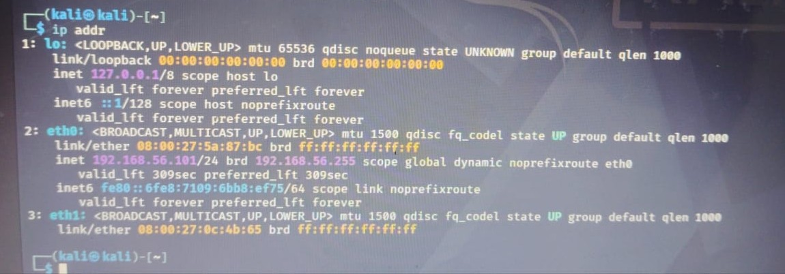
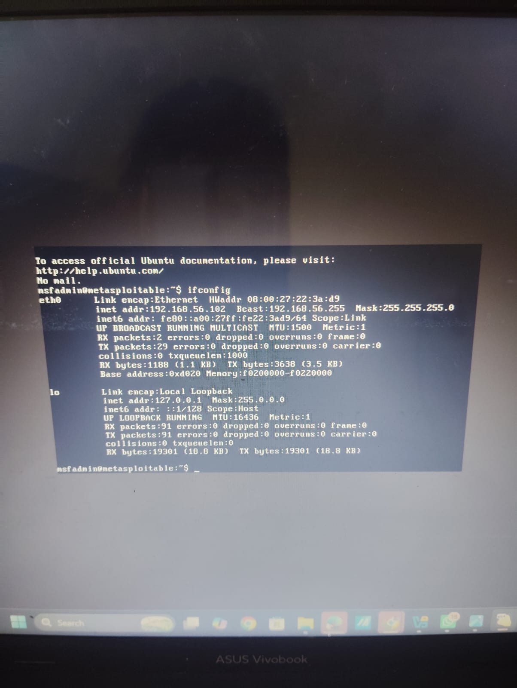
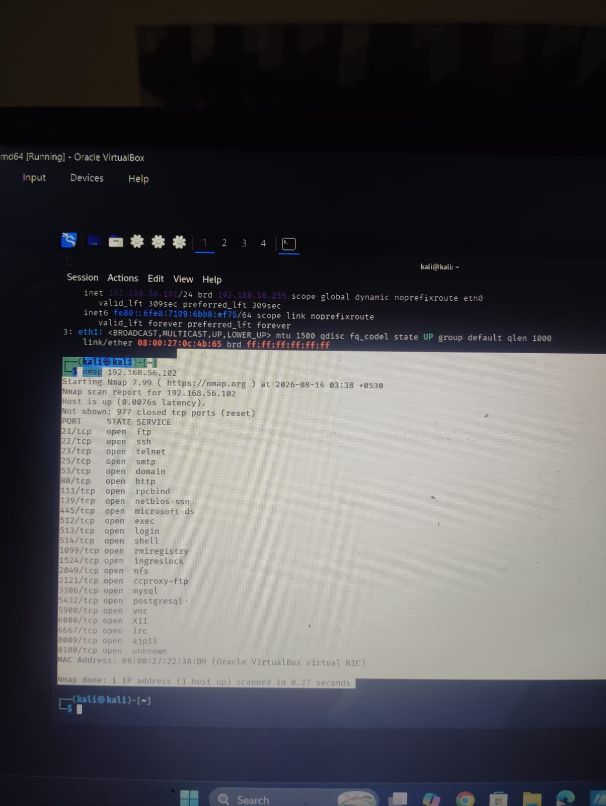
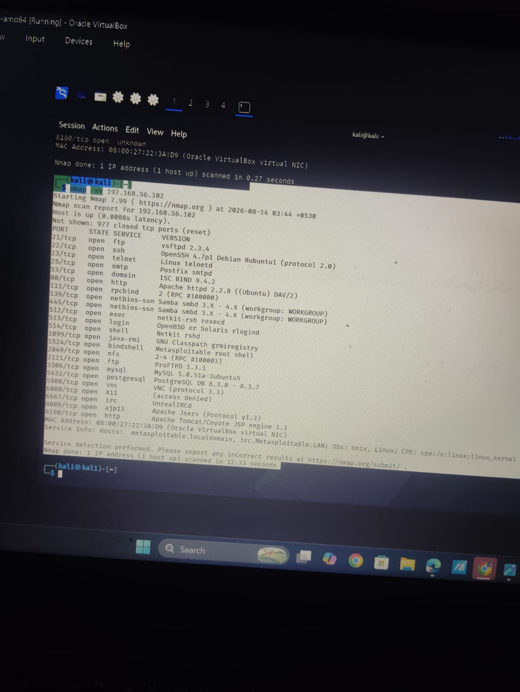

# 🔎 Network Reconnaissance using Nmap

## 📌 Project Overview
This project demonstrates network reconnaissance and service enumeration using Kali Linux and Nmap against an intentionally vulnerable Metasploitable 2 virtual machine.

The project was performed in a controlled VirtualBox lab environment.

The main objective was to identify the target, verify connectivity, discover open ports, identify running services and analyze the exposed attack surface.

---

## 🧪 Lab Environment

| Component | Details |
|---|---|
| Security Testing Machine | Kali Linux |
| Target Machine | Metasploitable 2 |
| Kali IP | 192.168.56.101 |
| Target IP | 192.168.56.102 |
| Network | 192.168.56.0/24 |
| Interface | eth0 |
| Virtualization | VirtualBox |
| Tool | Nmap |

---

# 🔹 Step 1: Check Kali Linux IP Address

First, the IP configuration of the Kali Linux machine was checked.

### Command

ip addr

### Result

Kali Linux was assigned:

192.168.56.101/24

The active interface was:

eth0

The target Metasploitable 2 machine was:

192.168.56.102

Both machines were on the same 192.168.56.0/24 network.

### Screenshot

---

# 🔹 Step 2: Test Connectivity using Ping

Connectivity between Kali Linux and Metasploitable was tested using ICMP Ping.

### Command

ping -c 4 192.168.56.102

### Result

64 bytes from 192.168.56.102: icmp_seq=1 ttl=64
64 bytes from 192.168.56.102: icmp_seq=2 ttl=64
64 bytes from 192.168.56.102: icmp_seq=3 ttl=64
64 bytes from 192.168.56.102: icmp_seq=4 ttl=64

4 packets transmitted
4 received
0% packet loss

### Analysis

The result confirmed that:

- The target host was reachable.
- ICMP communication was working.
- No packet loss was observed.
- Kali Linux could communicate with the target.

### What is Ping?

Ping is a network diagnostic utility used to check whether a host is reachable.

Ping uses ICMP Echo Request and ICMP Echo Reply messages.

Kali Linux
    |
    | ICMP Echo Request
    ↓
Metasploitable
    |
    | ICMP Echo Reply
    ↓
Kali Linux

### What is ICMP?

ICMP stands for Internet Control Message Protocol.

It is used for network diagnostics, error reporting and control messages.

### What is TTL?

The response contained:

ttl=64

TTL stands for Time To Live.

TTL limits the number of network hops an IP packet can make before it is discarded.

For example:

Initial TTL = 64
Router 1 → 63
Router 2 → 62
Router 3 → 61

In this local lab, the target returned TTL 64.

TTL can provide clues about the originating operating system/network stack, but TTL alone should not be considered definitive OS identification.

# 🔹 Step 3: Verify Local Connectivity using ARP

ARP was used to verify Layer-2 connectivity with the target.

### Command

sudo arping -I eth0 192.168.56.102

### Result

The target responded with the MAC address:

08:00:27:22:3A:D9

Final result:

40 packets transmitted
40 packets received
0% unanswered

### Analysis

This confirmed that Kali Linux could resolve the target IP address to its MAC address.

IP Address
192.168.56.102
      ↓
     ARP
      ↓
MAC Address
08:00:27:22:3A:D9

ARP stands for Address Resolution Protocol.

It is used on an IPv4 local network to find the MAC address associated with an IP address.
---
# 🔹 Step 4: Perform Basic Nmap Port Scan

After confirming connectivity, a basic Nmap scan was performed.

### Command

nmap 192.168.56.102

### Result

Nmap identified the following open TCP ports:

21/tcp   open  ftp
22/tcp   open  ssh
23/tcp   open  telnet
25/tcp   open  smtp
53/tcp   open  domain
80/tcp   open  http
111/tcp  open  rpcbind
139/tcp  open  netbios-ssn
445/tcp  open  microsoft-ds
512/tcp  open  exec
513/tcp  open  login
514/tcp  open  shell
1099/tcp open  rmiregistry
1524/tcp open  ingreslock
2049/tcp open  nfs
2121/tcp open  ccproxy-ftp
3306/tcp open  mysql
5432/tcp open  postgresql
5900/tcp open  vnc
6000/tcp open  X11
6667/tcp open  irc
8009/tcp open  ajp13
8180/tcp open  unknown

Nmap also reported:

977 closed TCP ports

### Analysis

Examples of discovered services:

21   → FTP
22   → SSH
23   → Telnet
80   → HTTP
139  → SMB
445  → SMB
3306 → MySQL
5432 → PostgreSQL
5900 → VNC

An open port means that a service is listening and accepting network connections on that port.

An open port does not automatically mean that the service is vulnerable. Further investigation is required.

### Screenshot

---

# 🔹 Step 5: Service and Version Enumeration

After identifying open ports, service and version detection was performed.

### Command

nmap -sV 192.168.56.102

The -sV option attempts to identify the service and version running on open ports.

### Result

21/tcp   open  ftp         vsftpd 2.3.4
22/tcp   open  ssh         OpenSSH 4.7p1 Debian 8ubuntu1
23/tcp   open  telnet      Linux telnetd
25/tcp   open  smtp        Postfix smtpd
53/tcp   open  domain      ISC BIND 9.4.2
80/tcp   open  http        Apache httpd 2.2.8
111/tcp  open  rpcbind     2
139/tcp  open  netbios-ssn Samba smbd 3.X - 4.X
445/tcp  open  netbios-ssn Samba smbd 3.X - 4.X
512/tcp  open  exec        netkit-rsh rexecd
513/tcp  open  login       OpenBSD or Solaris rlogind
514/tcp  open  shell       Netkit rshd
1099/tcp open  java-rmi    GNU Classpath grmiregistry
1524/tcp open  bindshell   Metasploitable root shell
2049/tcp open  nfs         2-4
2121/tcp open  ftp         ProFTPD 1.3.1
3306/tcp open  mysql       MySQL 5.0.51a-3ubuntu5
5432/tcp open  postgresql  PostgreSQL 8.3.0 - 8.3.7
5900/tcp open  vnc         VNC protocol 3.3
6000/tcp open  X11         access denied
6667/tcp open  irc         UnrealIRCd
8009/tcp open  ajp13       Apache Jserv Protocol v1.3
8180/tcp open  http        Apache Tomcat/Coyote JSP engine 1.1

### Additional Information

Target MAC Address:

08:00:27:22:3A:D9

Nmap identified the target as:

metasploitable.localdomain

Operating system information:

Unix / Linux

### Analysis

Service enumeration provides more information than a basic port scan.

For example:

22/tcp open ssh

only tells us that SSH is available.

After version detection:

22/tcp open ssh OpenSSH 4.7p1

we have additional information about the software running on that port.

This information can help security teams identify outdated software and prioritize security assessment and patching.

### Screenshot

---
# 🔹 Attack Surface Analysis

The scan identified several categories of exposed services.

## Remote Access Services

22   → SSH
23   → Telnet
5900 → VNC

These services provide remote access capabilities and should be properly secured and monitored.

## Web Services

80   → HTTP
8009 → AJP13
8180 → Apache Tomcat

Web-facing services should be patched, securely configured and monitored.

## File Sharing Services

21   → FTP
139  → SMB
445  → SMB
2049 → NFS
2121 → FTP

File-sharing services should be restricted to authorized users and systems.

## Database Services

3306 → MySQL
5432 → PostgreSQL

Database services should not be unnecessarily exposed to untrusted networks.

---

# 🔹 Security Findings

The reconnaissance exercise identified:

- Multiple open TCP ports
- Multiple remote-access services
- Legacy network services
- Multiple web services
- File-sharing services
- Database services
- Service and version information
- A large exposed attack surface

The target is Metasploitable 2, which is intentionally vulnerable and designed for security training.

---

# 🔹 SOC Analyst Relevance

Network reconnaissance is important from a SOC Analyst perspective.

An attacker may perform scanning before attempting exploitation.

A SOC Analyst may detect:

- Multiple connection attempts
- Connections to many ports
- Port scanning
- Service enumeration
- Repeated network requests
- Scanning activity from a single source IP

Such activity can be investigated using:

- SIEM
- Firewall logs
- IDS/IPS
- Network traffic analysis
- Authentication logs
- Endpoint logs

For example, if one source IP rapidly attempts connections to many ports on the same target, a SOC Analyst may investigate it as possible reconnaissance activity.

---

# 🔹 Project Workflow

Check IP Configuration
        ↓
Identify Target
        ↓
Ping Connectivity Test
        ↓
ARP Verification
        ↓
Nmap Port Scan
        ↓
Service & Version Detection
        ↓
Attack Surface Analysis
        ↓
Security Findings
        ↓
SOC Analysis

---

# 🔹 Conclusion

This project demonstrated a complete network reconnaissance and service enumeration workflow using Kali Linux and Nmap against an intentionally vulnerable Metasploitable 2 virtual machine.

The project covered:

- IP configuration
- ICMP Ping
- TTL
- ARP
- MAC address identification
- TCP port discovery
- Service enumeration
- Version detection
- Attack surface analysis
- Security observations
- SOC Analyst relevance

The practical exercise provided hands-on experience in identifying exposed network services and understanding how reconnaissance activity can be relevant to SOC monitoring and investigation.

---

